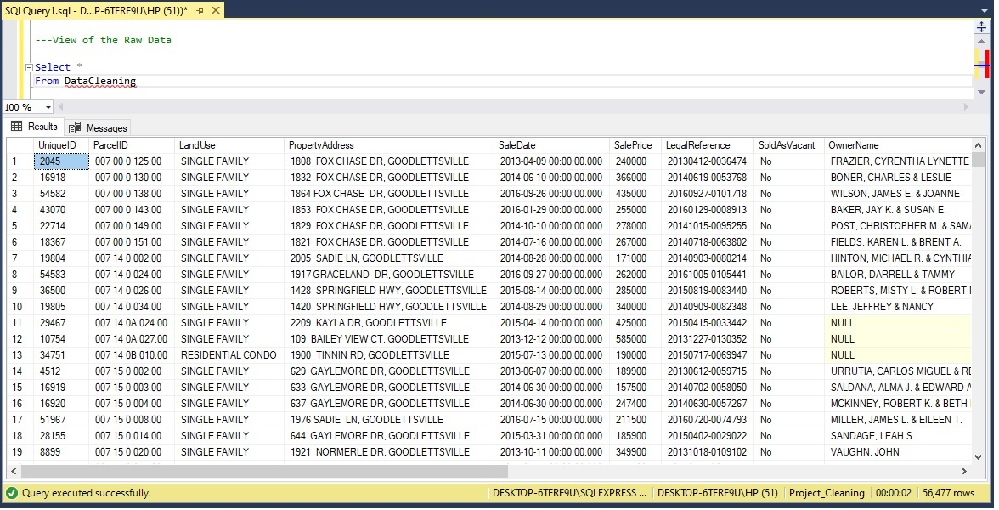
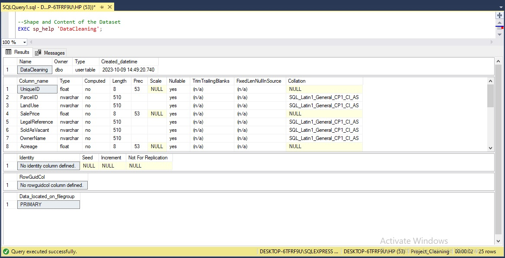
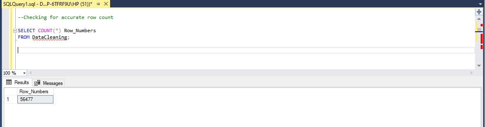
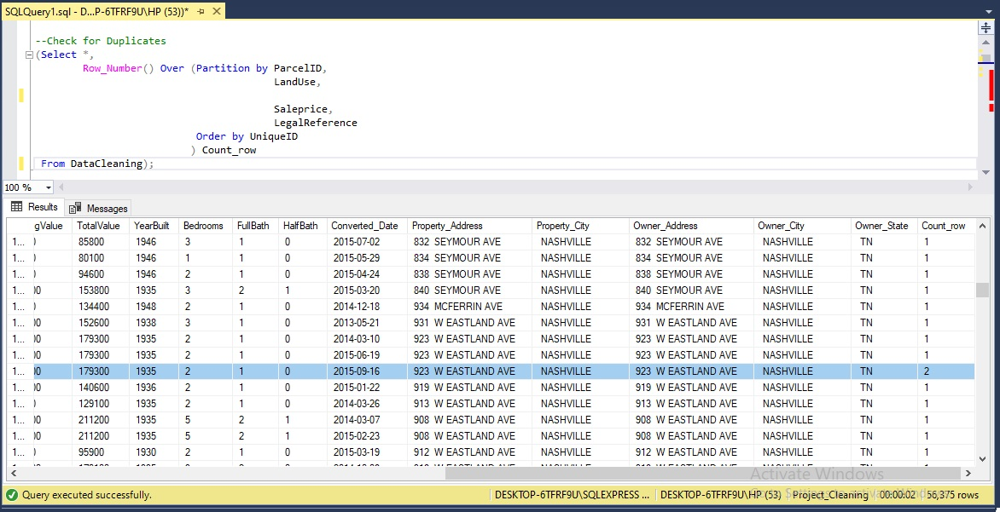
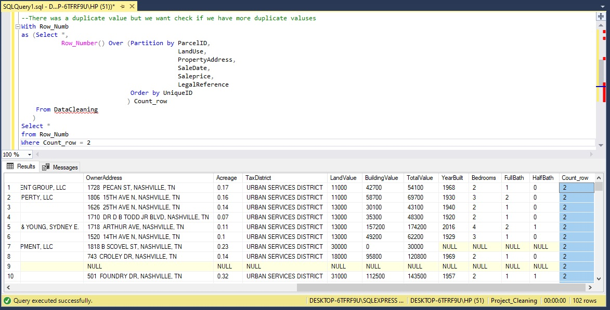
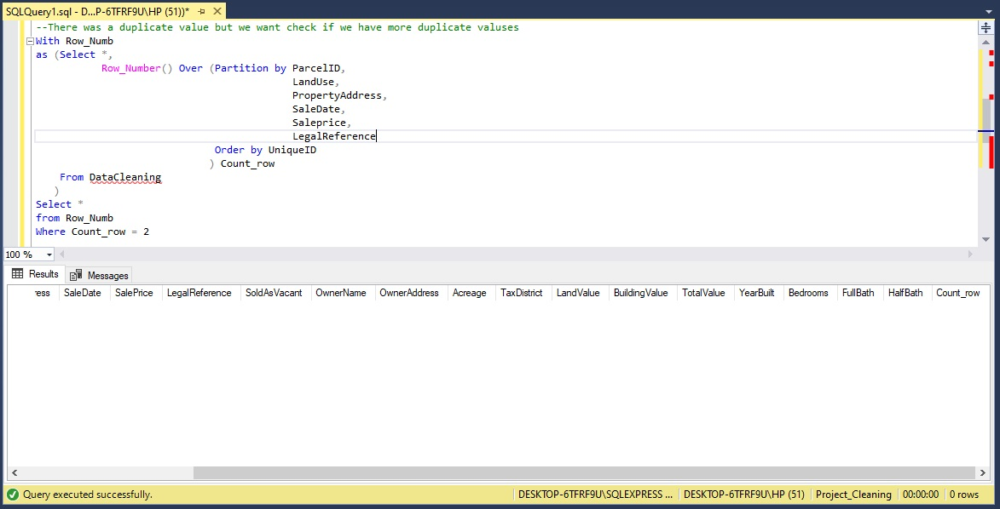

# Data-Cleaning-using-SQL

## Intorduction 
In the realm of data analysis, projects often take us to intriguing datasets that hold valuable insights waiting to be uncovered. In one such endeavor, I ventured into the world of the Nashville Housing Data, a comprehensive information detailing land use and property information in the Tennessee capital, Nashville. To unlock the dataset's hidden potential, I harnessed SQL through Microsoft SQL Management Server Studio, embarking on an extensive journey of exploration and data cleansing.

SQL, or Structured Query Language, is a potent tool for efficient data cleaning and transformation. With a range of functions and operations at its disposal, SQL stands as a widely recognized computer language for managing and manipulating relational databases.

In this project, we'll delve into how SQL can elevate dataset quality. We'll explore syntax and showcase SQL queries for data cleansing. To illustrate effective cleaning techniques and best practices, we'll provide SQL code samples, shedding light on the art of effective data refinement.

## Dataset 
The dataset was gotten from Kaggle. You can find the dataset [here.](https://github.com/Geephted/Data-Cleaning-using-SQL/blob/main/Nashville%20Housing%20Data%20for%20Data%20Cleaning.xlsx)

## Understanding the Nashville Housing Data Dataset

The dataset is composed of 19 columns and comprises various data types.

- UniqueID — id number attributed to a buyer.
- ParcelID — code attributed to a land.
- LandUse — shows the different uses of land.
- SalesPrice — cost of land
- LegalReference — citation is the practice of crediting and referring to authoritative documents and sources.
- OwnerName_ name of land owner
- Acreage — the size of an area of land in acres
- LandValue — the worth of the land
- Building Value — worth of a building
- Total Value — landvalue + building value
- YearBuilt — year the building was built
- FullBath — a bathroom that includes a shower, a bathtub, a sink, and a toilet.
- HalfBath — a half bathroom only contains a sink and a toilet
- Sale_Date — date when the land was sold
- SaleAddress — address of land sold
- City — location of land
- Owner_Address — owners house address
- OwnerCity — city where owner lives
- OwnerState — state where owner is located

As it would be essential for the cleaning process, we would first try to comprehend and understand the dataset in order to gain a sense of it and see its shape.

```
--View of the Raw Data
Select * 
From DataCleaning;
```



```
--Shape and Content of the Dataset
EXEC sp_help 'DataCleaning';
```



We can also view the number of rows in the dataset.

```
--Checking for accurate row count 
SELECT COUNT(*) Row_Numbers
FROM DataCleaning;
```



As the query reveals, we have 56,477 rows in the dataset, which tells us it is a pretty large dataset. We now have an idea of what our dataset looks like, so we can proceed with the data-cleaning process properly.

## Data Cleaning

### 1. Duplicates
Checking for duplicates in the data is the first step i took in the data cleaning process because having duplicate values in our data can distort outcomes, introduce errors, and ultimately undermine the precision and reliability of the data.

```
--Check for Duplicates
(Select *,
        Row_Number() Over (Partition by ParcelID,
                                        LandUse,
                                        
                                        Saleprice,
                                        LegalReference
                           Order by UniqueID
                          ) Count_row
 From DataCleaning);
```


Uing the Row Number syntax, the result above reveals the existence of a duplicate within the dataset. Consequently, we will proceed to formulate additional query  to further investigate and identify any additional duplicate entries.

```
With Row_Numb
as (Select *,
           Row_Number() Over (Partition by ParcelID,
                                           LandUse,
                                           PropertyAddress,
                                           SaleDate,
                                           Saleprice,
                                           LegalReference
                              Order by UniqueID
                             ) Count_row
    From DataCleaning
   )
Select *
from Row_Numb
Where Count_row = 2
```



Utilizing the same Row number syntax to identify rows with counts that equals to 2, we have observed indications of duplicates values within the dataset. As data analysts, our responsibility lies in conducting a thorough examination of the data to gain a comprehensive understanding of the situation. To ascertain whether these entries are genuine duplicates with identical values, a meticulous verification of the data is essential. Deciding on the appropriate course of action for handling these duplicate values hinges on our ability to pinpoint the root cause behind their presence.

The next step is to delete the duplicates that were found in the dataset 

```--Delete Duplicate 

With Row_Numb
as (Select *,
           Row_Number() Over (Partition by ParcelID,
                                           LandUse,
                                           PropertyAddress,
                                           SaleDate,
                                           Saleprice,
                                           LegalReference
                              Order by UniqueID
                             ) Count_row
    From DataCleaning
   )
Delete 
from Row_Numb
Where Count_row = 2
```
After applying the syntax to remove the duplicates identified in the dataset, I chose to re-run the duplicate-checking syntax to determine if any duplicates remained. The following results illustrate the outcome.




