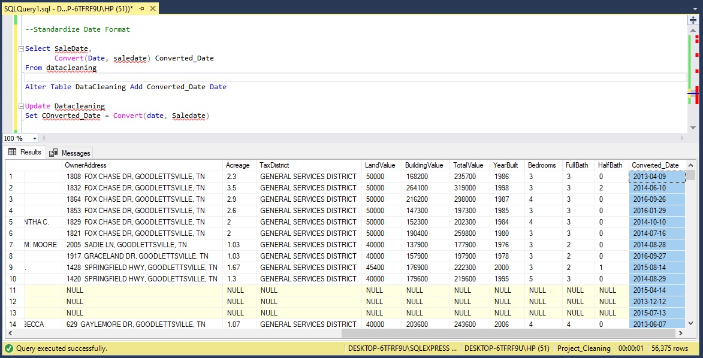
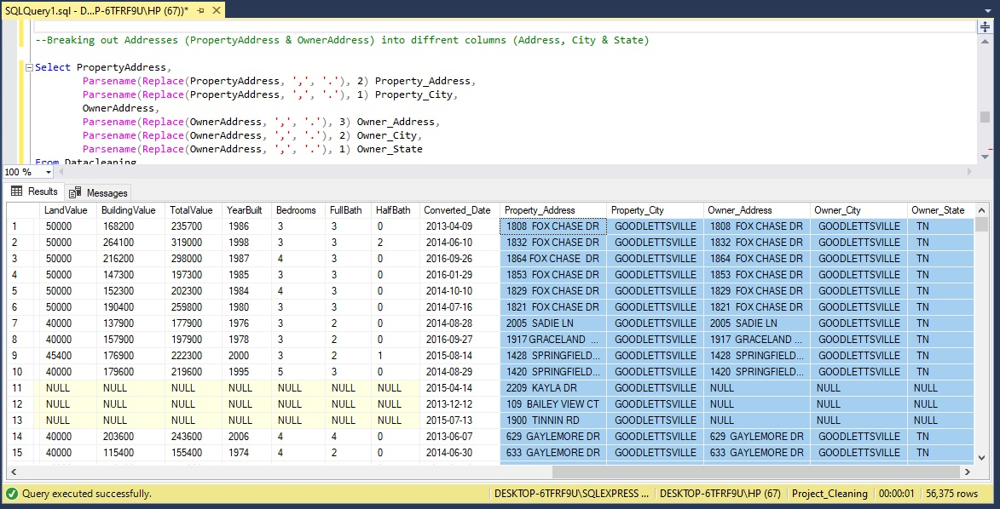
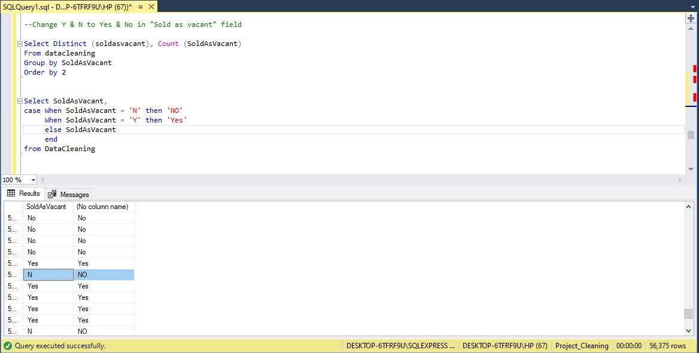
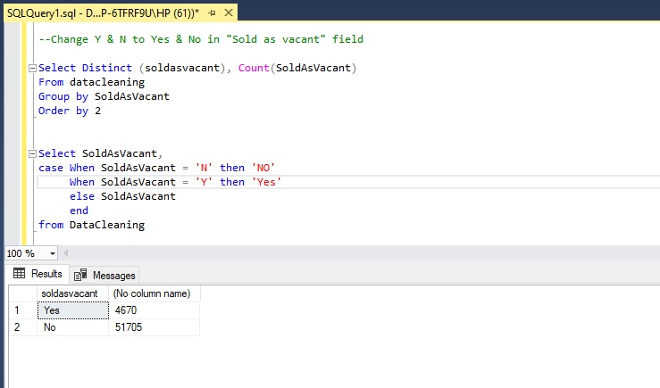

# Data-Cleaning-using-SQL

## Introduction  
In the realm of data analysis, projects often take us to captivating datasets that hold valuable insights waiting to be uncovered. In one such endeavor, I ventured into the world of the Nashville Housing Data, a comprehensive information detailing land use and property information in the Tennessee capital, Nashville. To unlock the dataset's hidden potential, I harnessed SQL through Microsoft SQL Management Server Studio, embarking on an extensive journey of exploration and data cleansing.

SQL (Structured Query Language), is a potent tool for efficient data cleaning and transformation. With a range of functions and operations at its disposal, SQL stands as a widely recognized computer language for managing and manipulating relational databases.

In this project, l will explore syntax and showcase SQL queries for data cleansing. To illustrate effective cleaning techniques and best practices, l will provide SQL code samples, shedding light on the art of effective data refinement.

## Dataset 
The dataset was gotten from Kaggle. You can find the dataset [here.](https://github.com/Geephted/Data-Cleaning-using-SQL/blob/main/Nashville%20Housing%20Data%20for%20Data%20Cleaning.xlsx)

## Understanding the Nashville Housing Dataset

The dataset is composed of 19 columns and comprises various data types.

- UniqueID — id number attributed to a buyer.
- ParcelID — code attributed to a land.
- LandUse — shows the different uses of land.
- SalesPrice — cost of land
- LegalReference — citation is the practice of crediting and referring to authoritative documents and sources.
- OwnerName_ name of land owner
- Acreage — the size of an area of land in acres
- LandValue — the worth of the land
- Building Value — worth of a building
- Total Value — landvalue + building value
- YearBuilt — year the building was built
- FullBath — a bathroom that includes a shower, a bathtub, a sink, and a toilet.
- HalfBath — a half bathroom only contains a sink and a toilet
- SaleDate — date when the land was sold
- SaleAddress — address of land sold
- City — location of land
- Owner_Address — owners house address
- OwnerCity — city where owner lives
- OwnerState — state where owner is located

As it would be essential for the cleaning process, we would first try to comprehend and understand the dataset in order to gain a sense of it and see its shape.

```
--View of the Raw Data
Select * 
From DataCleaning;
```


```
--Shape and Content of the Dataset
EXEC sp_help 'DataCleaning';
```


We can also view the number of rows in the dataset.

```
--Checking for accurate row count 
SELECT COUNT(*) Row_Numbers
FROM DataCleaning;
```


As the query reveals, we have 56,477 rows in the dataset, which tells us it is a pretty large dataset. We now have an idea of what our dataset looks like, so we can proceed with the data-cleaning process properly.

## Data Cleaning

### 1. Removing Duplicates
The removal of duplicate entries from a dataset is a critical component of data cleaning and preparation, as it significantly impacts data accuracy and quality. Duplicates can introduce errors, skew analytical outcomes, and complicate data interpretation. A thorough process of identification and elimination results in a more streamlined and accurate dataset, thus enhancing data reliability.  In the context of the Nashville Housing Data, the initial step I undertook in the data cleaning process involved checking for duplicates, as the presence of duplicate values has the potential to distort results, introduce errors, and ultimately undermine data precision and reliability.

```
--Check for Duplicates
Select *,
        Row_Number() Over (Partition by ParcelID,
                                        LandUse,
                                        Saleprice,
                                        LegalReference
                           Order by UniqueID
                          ) Count_row
 From DataCleaning;
```


Using the Row Number syntax, the result above reveals the existence of a duplicate within the dataset. Consequently, we will proceed to formulate additional query  to further investigate and identify any additional duplicate entries.

```
With Row_Numb
as (Select *,
           Row_Number() Over (Partition by ParcelID,
                                           LandUse,
                                           PropertyAddress,
                                           SaleDate,
                                           Saleprice,
                                           LegalReference
                              Order by UniqueID
                             ) Count_row
    From DataCleaning
   )
Select *
from Row_Numb
Where Count_row = 2;
```


Utilizing the same Row number syntax to identify rows with counts that equals to 2, we have observed indications of duplicates values within the dataset. As data analysts, our responsibility lies in conducting a thorough examination of the data to gain a comprehensive understanding of the situation. To ascertain whether these entries are genuine duplicates with identical values, a meticulous verification of the data is essential. Deciding on the appropriate course of action for handling these duplicate values hinges on our ability to pinpoint the root cause behind their presence.

The next step is to delete the duplicates that were found in the dataset 

```--Delete Duplicate 

With Row_Numb
as (Select *,
           Row_Number() Over (Partition by ParcelID,
                                           LandUse,
                                           PropertyAddress,
                                           SaleDate,
                                           Saleprice,
                                           LegalReference
                              Order by UniqueID
                             ) Count_row
    From DataCleaning
   )
Delete 
from Row_Numb
Where Count_row = 2;
```
After applying the syntax to remove the duplicates identified in the dataset, I chose to re-run the duplicate-checking syntax to determine if any duplicates remained. The following results illustrate the outcome.


### 2. Standardizing Date Format 
In the world of data analysis, we often encounter datasets that, while rich in information, lack consistency in critical aspects. One such challenge lies in the format of dates within the dataset. Dates might appear in various structures, making analysis cumbersome. In this scenario, Nashville Housing Data lacks a standardized date format, with too many zeros. To address this issue we're gearing up to write SQL code that will harmonize the date format throughout the dataset. This standardization process will ensure that dates are consistent and easily interpretable, facilitating more accurate and efficient data analysis.

```
--Standardize Date Format 
Select SaleDate,
       Convert(Date, saledate) Converted_Date
From datacleaning;

Alter Table DataCleaning Add Converted_Date Date;

Update Datacleaning
Set COnverted_Date = Convert(date, Saledate);
```
The dataset displayed below reflects the successful update, demonstrating the implementation of standardized date formats after executing the above syntax.



I proceeded to drop the "saledate" column, which had already been standardized.

```
--Deleting the date with irregularlity 
Alter Table Datacleaning
Drop column SaleDate
```

### 3. Breaking out Addresses (PropertyAddress & OwnerAddress) into different columns (Address, City & State) 

In the realm of data preparation and enhancement, one common challenge often encountered is the need to break down address information into distinct columns for improved organization and analysis. This practice involves splitting the combined "PropertyAddress" and "OwnerAddress" fields into separate columns for "Address," "City," and "State." By disentangling these components, the dataset becomes more structured and accessible, facilitating more refined geospatial and demographic analysis. This transformation not only enhances data clarity but also streamlines the ability to query and visualize address-related data effectively, providing valuable insights for various applications.

```
Select PropertyAddress,
		Parsename(Replace(PropertyAddress, ',', '.'), 2) Property_Address,
		Parsename(Replace(PropertyAddress, ',', '.'), 1) Property_City,
		OwnerAddress, 
		Parsename(Replace(OwnerAddress, ',', '.'), 3) Owner_Address,
		Parsename(Replace(OwnerAddress, ',', '.'), 2) Owner_City,
		Parsename(Replace(OwnerAddress, ',', '.'), 1) Owner_State
From Datacleaning;

Alter Table DataCleaning Add Property_Address NvarChar(255),
							 Property_City NvarChar(255),
							 Owner_Address NvarChar(255),
							 Owner_City NvarChar(255),
							 Owner_State NvarChar(255);

Update Datacleaning
Set Property_Address = Parsename(Replace(PropertyAddress, ',', '.'), 2),
	Property_City = Parsename(Replace(PropertyAddress, ',', '.'), 1),
	Owner_Address = Parsename(Replace(OwnerAddress, ',', '.'), 3),
	Owner_City = Parsename(Replace(OwnerAddress, ',', '.'), 2),
	Owner_State = Parsename(Replace(OwnerAddress, ',', '.'), 1);
```



### 4. Change Y & N to Yes & No in "Sold as vacant" field
In data refinement, precision and clarity are paramount. To achieve this, sometimes it's essential to convert ambiguous abbreviations like "Y" and "N" into more explicit terms like "Yes" and "No." For instance, in the "Sold as vacant" field of a dataset, making this simple yet significant change from "Y" and "N" to "Yes" and "No" not only enhances readability but also eliminates any room for misinterpretation. This data transformation ensures that the information is presented in a more accessible manner, contributing to better-informed decisions and analysis while reducing the risk of miscommunication or errors.

```
Select Distinct (soldasvacant), Count(SoldAsVacant)
From datacleaning 
Group by SoldAsVacant
Order by 2;

Select SoldAsVacant, 
case When SoldAsVacant = 'N' then 'NO'
     When SoldAsVacant = 'Y' then 'Yes'
	 else SoldAsVacant
	 end
from DataCleaning;

Update Datacleaning 
Set SoldAsVacant = case When SoldAsVacant = 'N' then 'NO'
     When SoldAsVacant = 'Y' then 'Yes'
	 else SoldAsVacant
	 end;
```





The two screenshots above illustrate the transformation of "N" into "No" and "Y" into "Yes." Following this conversion, the subsequent step involved counting the occurrences of "No" and "Yes" in the dataset to provide a clearer view of the data distribution after the update.

## Conclusion
Data cleaning is an integral phase in any data analysis project, serving as the foundation for accurate, complete, and consistent data. In the context of the Nashville Housing Data, our data cleaning process encompassed a range of techniques, including the removal of duplicates, standardization of date formats, breaking down addresses, and transforming "Y" and "N" to "Yes" and "No" in the "Sold as vacant" field. These measures culminated in a clean, well-structured dataset, poised for in-depth analysis. The cleaned dataset now provides dependable information, opening the door to valuable insights into player attributes, team performance, and other soccer-related factors.
